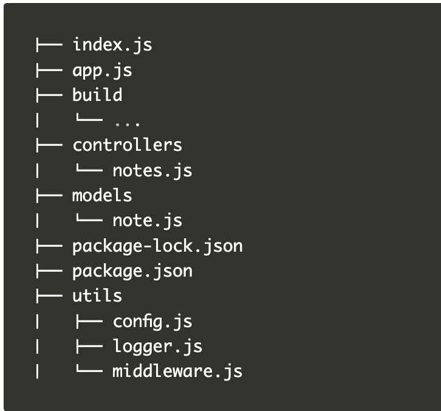

# Backend for notes application

Added 8.8.8.8 in the public DNS in my system under the Ethernet -IP V4 to get be able to connect to MongoDB atlas using mongoose.js

## Features

- search

## Libraries

- [express-async-errors](https://github.com/davidbanham/express-async-errors)

## Project structure

